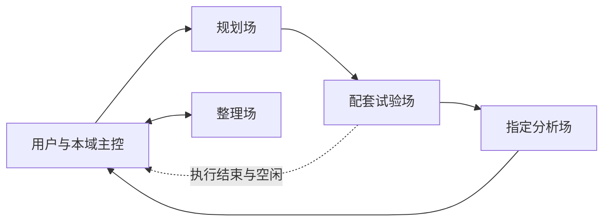

# 运行方式与文件边界

本工具由共用收发室、可重复安装的运行器和十项岗位技能组成。公开包只保存通用协作机制与模拟测试；文件完整性见provenance.json。项目的实际任务、岗位地址、认证及本机状态由各项目独立管理。

各箭头通过同一个轻量收发室按接收方原生排队。只有主控决定新任务；岗位间普通交接直接进行。规划不改业务代码，试验完成工程和执行，分析独立核查真实证据。软件开发可沿同样流程运行，任务明确授权业务写入；科研候选默认独立保存。

## 三类文件

- 可共享框架：.agents/basecamp里的运行器与规则、.agents/skills里的十项技能，适合提交到新项目Git。
- 项目定义：project.json中的名称、领域和岗位编制，用户可选择research每域13岗或compact每域5岗。默认模型和权限继承，不把源项目固定型号或完全访问设置传播到其他机器。
- 本机状态：.codex-basecamp中的roles.json、provision.json、发送回执和config.local.json，默认被忽略。每台机器重新登记本机真实地址，克隆不会恢复源项目对话。

配置路径从目标目录计算；CLI通过可执行文件/npm入口发现，也允许BASECAMP_CODEX_CLI指定本机入口。桌面入口沿用当前用户安装包登记自动发现及一次有界升级恢复。框架不安装或复制Codex本体，不迁移认证。

## 与Codex的边界

项目AGENTS提供启动规则，项目级技能按需加载。这部分使用官方支持的入口：[AGENTS规则](https://learn.chatgpt.com/docs/agent-configuration/agents-md)、[项目技能](https://learn.chatgpt.com/docs/build-skills)。

通信通过本机App Server与桌面工具桥接。[官方App Server文档](https://learn.chatgpt.com/docs/app-server)描述协议和线程操作；本机thread/queue/add及桌面工具包内入口是需要实际版本验证的适配点，不能仅依据官方App Server存在就推断它们永久可用。doctor检查实际安装的模式定义和tools/list，失败明确报告，不降级成打断忙碌岗位或后台偷偷执行任务。

原生桌面创建使用真实projectId。共享目录是这套岗位互相读写同一任务材料的基础，必须对应用户要求；默认不偷偷为其他项目创建worktree或更改全局配置。创建期望值与实际配置分别记录，当前接口不能可靠设置/核验的Fast和权限不会伪称已启用。

本版实际验证平台为Windows Codex桌面。安装程序与文件锁包含跨平台处理，但Mac/Linux桌面自动化没有实测；缺相应能力时保留文件展开结果并报告，不能把模拟岗位冒充真实桌面任务。
